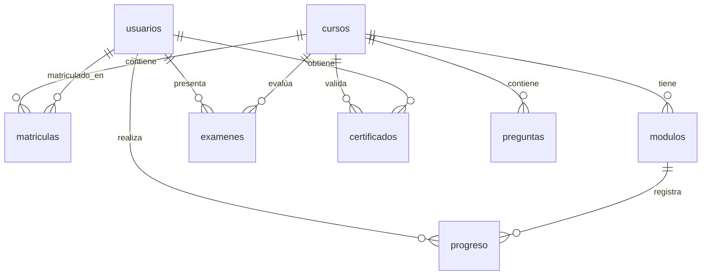

# Arquitectura y Diseño — Instituto Superior del Norte LMS

Arquitectura vigente, patrones adoptados, estructura de directorios y decisiones
de diseño que deben respetarse.

---

## 1. Patrón arquitectónico

### Backend (Layered Architecture)

```
INFRASTRUCTURE (Express, SQLite, Middlewares)
  └── CONTROLLERS (Parseo HTTP, Formato de Respuesta)
        └── SERVICES (Lógica de Negocio Pura)
              └── REPOSITORIES (Consultas SQL Aisladas)
```

| Capa | Archivos | Responsabilidad |
|---|---|---|
| Infrastructure | `server.js`, `middleware/auth.js`, `middleware/rateLimiter.js`, `middleware/errorHandler.js` | Express, CORS allowlist, headers de seguridad, body limit, JWT (fail-fast en secreto débil), rate limiting, manejo global de errores (enmascara 5xx en prod), `ADMIN_ROLES` |
| Routes | `routes/authRoutes.js`, `adminRoutes.js`, `studentRoutes.js`, `publicRoutes.js` | Registro de endpoints y aplicación de middlewares |
| Controllers | `controllers/authController.js`, `adminController.js`, `studentController.js`, `publicController.js` | Parseo de request, validación de payload, formato de response |
| Services | `services/pdfService.js`, `emailService.js`, `certificateTemplateService.js`, `academicTemplateService.js` | Generación de PDFs, envío de emails, interpolación de plantillas |
| Repositories | `repositories/dbRepository.js`, `additionalSeedData.js`, `migrateContents.js` | Consultas SQL aisladas, inicialización de BD, seeding idempotente, migración de contenidos |

### Frontend (Context + Router Architecture)

```
main.tsx                          ← Bridge de hash legacy + createRoot
  └── AppProvider (AppContext.tsx) ← Estado global y fetch functions
        └── HashRouter (App.tsx)
              └── MainLayout        ← Navbar, Footer, Routes, Auth Guard
                    └── Routes
                          ├── /                     → HomePage.tsx (landing + verificador)
                          ├── /login                → Login.tsx
                          ├── /admin/login          → AdminLogin.tsx
                          ├── /dashboard            → Dashboard.tsx
                          ├── /course/:id/detail    → CourseRouteWrapper → CourseDetail.tsx
                          ├── /course/:id           → CourseRouteWrapper → CourseViewer.tsx
                          ├── /course/:id/exam      → CourseRouteWrapper → Exam.tsx
                          ├── /certificate/:id      → CourseRouteWrapper → Certificate.tsx
                          ├── /admin/dashboard      → AdminDashboard.tsx
                          ├── /admin/create-course  → CreateCourseScreen.tsx
                          ├── /verify               → VerifyCertificate.tsx
                          ├── /verify/:code         → VerifyRouteWrapper → VerifyCertificate.tsx
                          └── *                     → Navigate to "/"
```

> `BachillerCertificate.tsx` es un layout de diploma alternativo usado por
> `Certificate.tsx` para el curso "Bachiller Académico".

**Regla de navegación (CRÍTICA):** React Router es la **única fuente de verdad**.
Todos los componentes usan `useNavigate()`. **Nunca usar `setCurrentView()` para
navegar** — es estado legacy por compatibilidad.

**Bridge de hash legacy (CRÍTICA):** `main.tsx` reescribe `#verify=CÓDIGO` →
`#/verify/CÓDIGO` y `#admin` → `#/admin/login` **antes** de montar `HashRouter`.
Sin esto, la ruta comodín `*` redirige a `/` durante el primer render y rompe los
enlaces de verificación impresos en diplomas antiguos. No mover esta lógica a un
`useEffect` (es racy contra la ruta comodín).

---

## 2. Estructura de directorios actual

```
/Superior-del-norte (raíz)
├── CLAUDE.md                     # Guía raíz (auto-cargada por Claude Code)
├── .claude/
│   ├── launch.json               # Config de arranque del dev server (frontend)
│   └── docs/
│       ├── contexto-sistema.md   # Negocio, estado actual, brechas
│       ├── arquitectura.md       # Este archivo
│       ├── buenas-practicas.md   # Reglas de código y seguridad
│       ├── api.md                # Contrato y especificación de endpoints
│       └── agentes.md            # Gobernanza de agentes de contenido/diseño
├── backend/
│   ├── .env                      # PORT, NODE_ENV, JWT_SECRET, ALLOWED_ORIGINS, TRUST_PROXY_HOPS, FRONTEND_URL, SMTP_*, EMAIL_INCLUDE_PASSWORD
│   ├── package.json
│   └── src/
│       ├── server.js             # Express: config, CORS, registro de routers
│       ├── database.sqlite       # BD SQLite activa
│       ├── assets/               # logo, escudo, firmas, fuente GreatVibes
│       ├── middleware/
│       │   ├── auth.js           # authenticateToken, requireAdmin, requireRole, signToken, normalizeToUtf8, ADMIN_ROLES
│       │   ├── rateLimiter.js    # rateLimit({ windowMs, max }) en memoria por IP
│       │   └── errorHandler.js   # Error handler centralizado (no expone stack traces)
│       ├── routes/               # authRoutes, adminRoutes, studentRoutes, publicRoutes
│       ├── controllers/          # authController, adminController, studentController, publicController
│       ├── services/             # pdfService, emailService, certificateTemplateService, academicTemplateService
│       └── repositories/         # dbRepository, additionalSeedData, migrateContents
└── frontend/
    ├── package.json
    ├── vite.config.js            # Proxy /api → backend en dev
    ├── .env / .env.example       # VITE_API_BASE_URL, VITE_API_PROXY_TARGET
    ├── .agents/                  # Skill de diseño "impeccable" (tooling, no runtime)
    └── src/
        ├── main.tsx              # Bridge de hash legacy + createRoot
        ├── index.css             # Tokens CSS globales (:root)
        ├── App.tsx               # HashRouter, MainLayout, Routes, ProtectedRoute, Auth Guard
        ├── assets/               # Logos e imágenes estáticas
        ├── utils/sanitize.ts     # sanitizeHtml() — wrapper de DOMPurify
        ├── components/           # HomePage, Login, AdminLogin, Dashboard, CourseDetail, CourseViewer, Exam, Certificate, BachillerCertificate, AdminDashboard, CreateCourseScreen, VerifyCertificate
        └── context/AppContext.tsx # Estado global, fetch functions, autenticación, ADMIN_ROLES/isAdmin
```

---

## 3. AppContext — diseño y reglas de uso

`AppContext.tsx` centraliza todo el estado. Reglas para modificarlo:

- **Estado inicializado** (`token`, `user`, `currentView`) con **lazy `useState`**
  leyendo el JWT del `localStorage`. **NUNCA** agregar `useEffect([token])` que
  llame `setUser()` — crea un nuevo objeto `user` en cada ejecución → loop.
- **Deps de `useEffect`:** usar primitivos (`user?.cedula`, `user?.rol`), no el
  objeto `user`. Objetos se comparan por referencia → loop infinito garantizado.
- **Fetch functions:** envueltas en `useCallback` con `[token]` (referencia
  estable entre renders).

---

## 4. Base de datos — esquema



| Tabla | Columnas principales |
|---|---|
| `usuarios` | `cedula` (PK), `nombre_completo`, `password_hash`, `rol`, `email`, `fecha_registro`, `fecha_expedicion_cedula`, `municipio_expedicion_cedula`, `municipio_nacimiento`, `anio_nacimiento`, `pago_realizado` |
| `cursos` | `id` (PK), `titulo` (UNIQUE), `descripcion`, `imagen_url`, `creado_en`, `precio`, `certificado_template` (HTML opcional) |
| `matriculas` | Relación N:M `usuarios` ↔ `cursos` |
| `modulos` | `id` (PK), `curso_id`, `titulo_modulo`, `tipo_contenido`, `data_contenido` (JSON `{url, text}`), `orden` |
| `progreso` | `usuario_cedula`, `modulo_id`, `completado`, `fecha_completado` |
| `examenes` | `usuario_cedula`, `curso_id`, `puntaje_maximo`, `aprobado`, `intentos`, `fecha_ultimo_intento`, PK compuesta `(usuario_cedula, curso_id)` |
| `certificados` | `codigo_verificacion` (PK), `usuario_cedula`, `curso_id`, `fecha_emision`, `calificacion_obtenida`, `numero_certificado` (UNIQUE) |
| `preguntas` | `id` (PK), `curso_id`, `pregunta`, `opcion_a..d`, `respuesta_correcta` ('A'/'B'/'C'/'D') |

```sql
CREATE TABLE IF NOT EXISTS certificados (
    codigo_verificacion TEXT PRIMARY KEY,
    usuario_cedula TEXT,
    curso_id INTEGER DEFAULT 1,
    fecha_emision TEXT,
    calificacion_obtenida REAL,
    numero_certificado TEXT UNIQUE,
    FOREIGN KEY (usuario_cedula) REFERENCES usuarios(cedula) ON DELETE CASCADE,
    FOREIGN KEY (curso_id) REFERENCES cursos(id) ON DELETE CASCADE
);
```

### Restricción UNIQUE(titulo) y limpieza de duplicados
La columna `cursos.titulo` tiene restricción `UNIQUE` + índice `idx_cursos_titulo`.
Al iniciar, la migración atómica `cleanDuplicateCoursesSQLite()`:
1. Identifica cursos duplicados por título.
2. Re-mapea claves foráneas en cascada (`modulos`, `matriculas`, `progreso`,
   `examenes`, `certificados`, `preguntas`) al `id` más antiguo (`MIN(id)`).
3. Elimina de forma segura los duplicados y sus módulos.

### Regla de seeding (CRÍTICA)
- Seeding idempotente con `INSERT OR IGNORE` — seguro en cada arranque.
- **NUNCA** `DROP TABLE` + `CREATE TABLE` en `setupSqliteDB()`.

### Plantillas de certificado por curso
`cursos.certificado_template` (HTML crudo opcional) define el diseño del diploma.
Cuando existe:
1. `studentController.getCertificateDetail()` la obtiene vía JOIN y la interpola
   (`interpolateTemplate()`).
2. Tags soportados: `{{NOMBRE}}`, `{{CEDULA}}`, `{{FECHA_EXPEDICION}}`,
   `{{MUNICIPIO_EXPEDICION}}`, `{{ANIO_NACIMIENTO}}`, `{{CODIGO_VERIFICACION}}`,
   `{{FECHA_EMISION}}`.
3. `Certificate.tsx` la renderiza vía `dangerouslySetInnerHTML` **tras
   `sanitizeHtml()`**, con estilos `@media print`.
4. **Brecha:** `pdfService.js` no consume la plantilla personalizada — siempre
   genera la institucional.

---

## 5. Sistema de notificaciones por email

`emailService.js` con patrón **fire-and-forget**:
```js
sendWelcomeEmail({ cedula, nombre_completo, password, cursos })   // desde adminController.createStudent()
sendCertificateEmail(studentData, certData, courseTitle)          // desde studentController.submitExam() al aprobar
```
- **Desarrollo (SMTP_USER vacío):** cuenta efímera Ethereal; URL de preview en
  consola; no se envían emails reales.
- **Producción (SMTP_USER + SMTP_PASS):** transporte SMTP real. Configurar
  `FRONTEND_URL`. Destinatario: columna `email`; si `NULL`, deriva
  `${cedula}@institutosuperiordelnorte-student.co`.

---

## 6. Roles y rutas protegidas

| Rol | Rutas permitidas |
|---|---|
| Sin auth | `/`, `/login`, `/admin/login`, `/verify`, `/verify/:code` |
| `estudiante` | `/dashboard`, `/course/:id`, `/course/:id/detail`, `/course/:id/exam`, `/certificate/:id` |
| `administrador` | `/admin/dashboard`, `/admin/create-course` (+ `/api/admin/*` excepto `financial-metrics`) |
| `ingeniero_software` | Igual que admin + acceso exclusivo a `/api/admin/financial-metrics` |

> **Fuente de verdad de roles privilegiados:** `ADMIN_ROLES` en
> `backend/src/middleware/auth.js` y su espejo `ADMIN_ROLES`/`isAdmin` en
> `frontend/src/context/AppContext.tsx`. Cambiar ambos simultáneamente.

**Auth guard (doble capa):**
- **A nivel de ruta:** `<ProtectedRoute allowRoles={[...]}>` (en `App.tsx`)
  envuelve cada ruta privada y redirige a un usuario con rol equivocado a su home.
  Es la fuente de verdad de autorización de vistas.
- **A nivel de efecto:** el `useEffect` en `MainLayout` con deps primitivas sólo
  redirige desde `/login`, `/admin/login` o `/` al dashboard tras autenticar.

**`CourseRouteWrapper`:** sincroniza `activeCourseId` desde `:courseId` (único
punto URL→estado para course IDs). Permite deep linking a `/course/1`.

---

## 7. Brechas arquitectónicas pendientes

> [!TIP]
> **Mejoras recomendadas (por prioridad):**
> 1. **Verificación IDOR de matrícula (P0):** middleware `requireEnrollment` que
>    valide la fila en `matriculas` antes de servir contenido/examen/certificado.
> 2. **JWT en `localStorage`:** migrar a cookie `HttpOnly; Secure; SameSite=Strict`
>    + endpoint de revocación.
> 3. **Resolver Mojibake en origen:** `pragma encoding = 'UTF-8'` en SQLite y
>    eliminar `decodeMojibake` / `normalizeToUtf8`.
> 4. **Componentes monolíticos:** `AdminDashboard.tsx` maneja múltiples CRUDs.
>    Candidato a dividir en sub-componentes.
> 5. **Validación de payloads:** integrar `zod` en el backend.
> 6. **Sanitización backend de plantillas:** `interpolateTemplate` interpola en
>    HTML crudo sin escaping; migrar a Handlebars o escapar valores.
